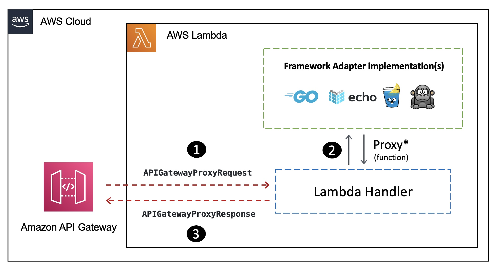

## Run Go REST APIs as AWS Lambda functions using the AWS Lambda Go API Proxy

The [Go](http://go.dev/) programming language has always had rich support for building REST APIs. This includes an [excellent standard library (net/http)](https://pkg.go.dev/net/http) along with many popular packages such as [gorilla mux](https://github.com/gorilla/), [Gin](https://github.com/gin-gonic/gin), [negroni](https://github.com/urfave/negroni), [echo](https://echo.labstack.com/), [fiber](https://github.com/gofiber/fiber) etc.

Thanks to the [AWS Lambda Go runtime](https://docs.aws.amazon.com/lambda/latest/dg/golang-handler.html?sc_channel=el&sc_campaign=datamlwave&sc_content=golang-apis-on-aws-lambda&sc_geo=mult&sc_country=mult&sc_outcome=acq), you can use Go to build AWS Lambda functions. [This blog post](https://community.aws/posts/golang-apis-on-aws-lambda) will demonstrate how to use the [AWS Lambda Go API Proxy](https://github.com/awslabs/aws-lambda-go-api-proxy) to run existing Go frameworks based APIs in a serverless way with AWS Lambda and Amazon API Gateway.

Here is a gist on how it works at a high level:

1. The API Gateway request is accepted by the Lambda function handler.
2. The function handler proxies the request to the adapter implementation corresponding to the framework.
3. Finally, the API Gateway proxy response is returned to the client.

## Security

See [CONTRIBUTING](CONTRIBUTING.md#security-issue-notifications) for more information.

## License

This library is licensed under the MIT-0 License. See the LICENSE file.

